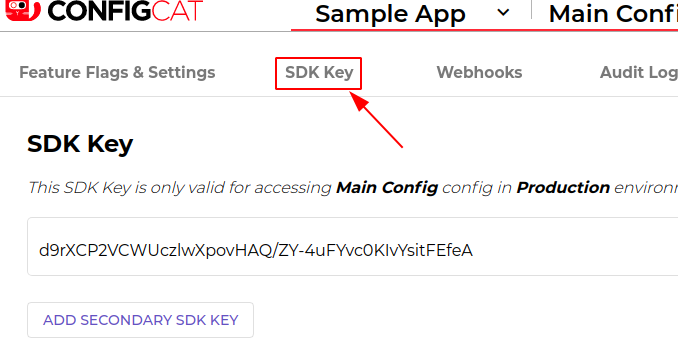

# ConfigCat SDK for Elixir

https://configcat.com
ConfigCat SDK for Elixir provides easy integration for your application to ConfigCat.

ConfigCat is a feature flag and configuration management service that lets you separate releases from deployments. You can turn your features ON/OFF using <a href="http://app.configcat.com" target="_blank">ConfigCat Dashboard</a> even after they are deployed. ConfigCat lets you target specific groups of users based on region, email or any other custom user attribute.

ConfigCat is a <a href="https://configcat.com" target="_blank">hosted feature flag service</a>. Manage feature toggles across frontend, backend, mobile, desktop apps. <a href="https://configcat.com" target="_blank">Alternative to LaunchDarkly</a>. Management app + feature flag SDKs.

[](https://travis-ci.com/configcat/elixir-sdk)
[](https://codecov.io/github/configcat/elixir-sdk?branch=master)
[](https://hex.pm/packages/configcat)
[](https://hex.pm/packages/configcat)

# Getting Started
### 1. Add `configcat` to your list of dependencies in `mix.exs`:

```elixir
def deps do
  [
    {:configcat, "~> 1.0.0"}
  ]
end
```
### 2. Go to <a href="https://app.configcat.com/sdkkey" target="_blank">Connect your application</a> tab to get your *SDK Key*:


### 3. Add `ConfigCat` to your application Supervisor tree:

```elixir
def start(_type, _args) do
  children = [
    {ConfigCat, [sdk_key: "YOUR SDK KEY"]},
    MyApp
  ]

  opts = [strategy: :one_for_one, name: Simple.Supervisor]
  Supervisor.start_link(children, opts)
end
```

### 4. Get your setting value:

```elixir
isMyAwesomeFeatureEnabled = ConfigCat.get_value("isMyAwesomeFeatureEnabled", false)
if isMyAwesomeFeatureEnabled do
  do_the_new_thing()
else
  do_the_old_thing()
end
```

## Getting user specific setting values with Targeting
Using this feature, you will be able to get different setting values for different users in your application by passing a `User Object` to the `get_value()` function.

Read more about [Targeting here](https://configcat.com/docs/advanced/targeting/).
```elixir
user = ConfigCat.User.new("#USER-IDENTIFIER#")

isMyAwesomeFeatureEnabled = ConfigCat.get_value("isMyAwesomeFeatureEnabled", false, user)
if isMyAwesomeFeatureEnabled do
    do_the_new_thing()
else
    do_the_old_thing()
end
```

## Sample/Demo apps
* [Sample Console Apps](https://github.com/configcat/elixir-sdk/tree/master/samples)

## Polling Modes
The ConfigCat SDK supports 3 different polling mechanisms to acquire the setting values from ConfigCat. After latest setting values are downloaded, they are stored in the internal cache then all requests are served from there. Read more about Polling Modes and how to use them at [ConfigCat Docs](https://configcat.com/docs/sdk-reference/elixir/).

## Need help?
https://configcat.com/support

## Contributing
Contributions are welcome.

## About ConfigCat
- [Official ConfigCat SDKs for other platforms](https://github.com/configcat)
- [Documentation](https://configcat.com/docs)
- [Blog](https://configcat.com/blog)
